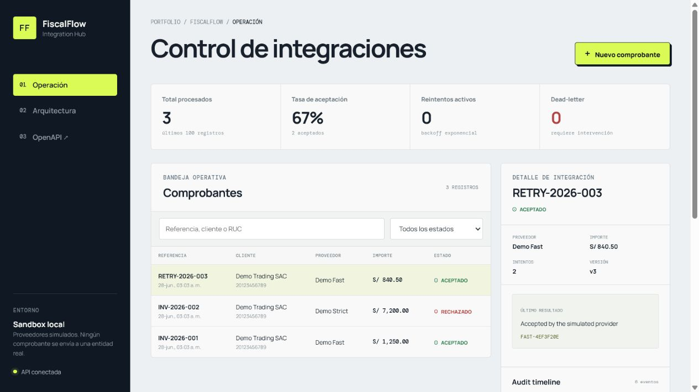
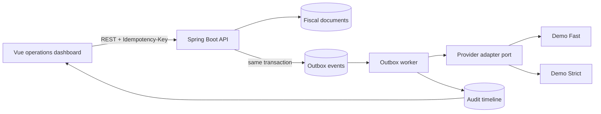

# FiscalFlow Integration Platform

[](https://github.com/Daniel349167/fiscalflow-integration-platform/actions/workflows/ci.yml)

Full Stack sandbox for operating electronic-document integrations with Java,
Spring Boot, Vue, PostgreSQL and Docker.

FiscalFlow demonstrates the engineering work around an integration: safe client
retries, provider abstraction, state transitions, transient failures, auditability
and an operator-facing UI. It is a personal portfolio project. It contains no
employer code, private documentation, credentials or production taxpayer data.

> This is not a SUNAT-certified invoicing product and is not affiliated with an
> OSE, PSE, The Factory HKA or any other provider. All provider behavior is simulated.



## Why this project exists

A basic invoicing demo normally stops after persisting a form. Real integration
work begins when clients retry requests, providers time out, business validations
reject a document and support needs to explain exactly what happened. FiscalFlow
models those failure paths explicitly.

## Architecture



The backend is a modular monolith. One team and one consistency boundary do not
justify multiple deployables yet. Provider-specific logic sits behind an adapter
port, so adding a real integration does not change the document workflow.

## Engineering depth

- **Idempotent creation:** the same key and payload return the original document;
  reusing a key with a different payload returns HTTP 409.
- **Transactional outbox:** queuing the aggregate and its submission command occurs
  in one PostgreSQL transaction.
- **Explicit state machine:** invalid transitions are rejected instead of silently
  corrupting status.
- **Provider adapters:** `DEMO_FAST` and `DEMO_STRICT` exercise acceptance, business
  rejection and transient failure without external credentials.
- **Retry and dead-letter:** transient failures use exponential backoff and become
  operator-visible after the retry budget is exhausted.
- **Audit trail:** every material transition records previous state, next state,
  reason and time.
- **Optimistic locking:** aggregate versioning protects concurrent updates.
- **Operability:** health probes, Prometheus metrics, OpenAPI and an operations UI.
- **Test pyramid:** domain tests, Vue component tests, PostgreSQL Testcontainers and
  a Docker Compose end-to-end workflow in CI.

Architecture decisions are documented under [`docs/adr`](docs/adr).

## Stack

| Layer | Technology |
| --- | --- |
| Frontend | Vue 3, TypeScript, Vite, Vitest |
| Backend | Java 17, Spring Boot 3.5, Bean Validation, ProblemDetail |
| Data | PostgreSQL 17, Spring Data JPA, Flyway |
| Integration | Provider adapter pattern, transactional outbox, scheduled retries |
| Delivery | Docker Compose, Nginx, GitHub Actions |
| Observability | Spring Actuator, Prometheus metrics, health probes |

## Run the complete product

Requirements: Docker Desktop and Docker Compose.

```bash
docker compose up --build --wait
```

Open:

- Operations dashboard: `http://localhost:4180`
- OpenAPI UI: `http://localhost:4180/swagger-ui.html`
- Health: `http://localhost:4180/actuator/health`
- Prometheus metrics: `http://localhost:4180/actuator/prometheus`

The local environment seeds three flows:

1. an accepted document;
2. a business rejection from the strict provider;
3. a transient timeout that succeeds after retry.

Stop and remove local data:

```bash
docker compose down --volumes
```

## API example

Create a draft safely:

```bash
curl -X POST http://localhost:4180/api/v1/documents \
  -H 'Content-Type: application/json' \
  -H 'Idempotency-Key: client-request-001' \
  -d '{
    "externalReference": "INV-2026-004",
    "documentType": "INVOICE",
    "provider": "DEMO_FAST",
    "customerTaxId": "20123456789",
    "customerName": "Cliente Demo SAC",
    "totalAmount": 420.50,
    "currency": "PEN"
  }'
```

Submit it using the returned id:

```bash
curl -X POST http://localhost:4180/api/v1/documents/{id}/submit
curl http://localhost:4180/api/v1/documents/{id}
```

Use an external reference containing `RETRY` to exercise transient failures. The
strict provider rejects totals above PEN 5,000.00.

## Test locally

Backend, including PostgreSQL Testcontainers:

```bash
cd backend
./gradlew clean test
```

Frontend:

```bash
cd frontend
npm ci
npm test
npm run build
```

## Production hardening still required

- OAuth2/OIDC, tenant or organization boundaries and role-based access.
- Real provider contracts, certificate custody and secret-manager integration.
- Split claim/call/finalize transactions around remote provider calls.
- `FOR UPDATE SKIP LOCKED` or equivalent outbox claiming for multiple workers.
- Webhook signatures, delivery deduplication and replay controls.
- Encryption at rest, data retention policy and PII-safe structured logging.
- Rate limits, SLOs, alert rules and load tests.

These gaps are explicit: the repository is designed for honest architecture
discussion, not to imply production certification.
